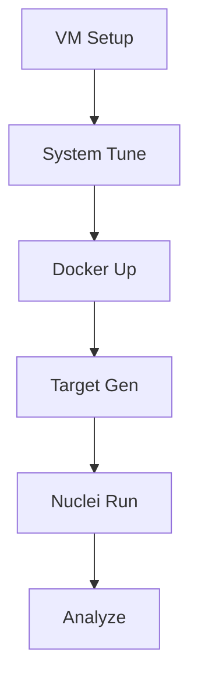

# Targets Farm for Nuclei Vulnerability Scanner Benchmarking

This project sets up a repeatable, cost-efficient target farm on a VM to simulate real-world targets for benchmarking and testing Nuclei scans. It generates 1000 FQDNs using sslip.io, routed via NGINX to different behavior buckets (ok, redirect, rl, delay1s, big, err, waf) for performance testing under load.

## VM Provisioning

- **Provider:** Hetzner (preferred for EU POPs and price/perf), OVHcloud, or Scaleway.
- **Specs:** Baseline Hetzner CPX31 (8 vCPU, 16GB RAM, NVMe SSD, 1 public IPv4). Use Ubuntu 24.04 LTS. This sustains ~2-3k RPS with headroom; scale to 32GB for heavier loads.
- **Cost:** Low; one small VM suffices initially.
- **Notes:** Ensure public IP is accessible. No DNS setup needed due to sslip.io.

## Quick Start (on VM)

1. **Clone the repo:**
   ```
   git clone <your-repo-url> targets-farm
   cd targets-farm
   chmod +x scripts/*.sh scripts/*.py
   ```

2. **Run setup:**
   ```
   ./scripts/setup.sh <YOUR_PUBLIC_IP>
   ```
   - Installs Docker, tunes kernel/limits.
   - Starts NGINX and go-httpbin services.
   - Generates `targets.txt` with 1000 URLs.
   - Runs smoke tests.

3. **Validate:**
   ```
   ./scripts/validate.sh <YOUR_PUBLIC_IP>
   ```
   - Checks Docker status, target count, endpoint responses.

4. **Benchmark with Nuclei:**
   ```
   nuclei -l targets.txt -t /path/to/templates -c 400 -rl 2500 -timeout 3 -retries 1 -jsonl -o results.jsonl
   ```

5. **Analyze results:**
   ```
   ./scripts/bucketize_results.sh results.jsonl
   ```
   - Shows findings per bucket and HTTP code distribution from logs.

## Behaviors and Buckets

- **ok (400):** Fast 200 JSON responses.
- **redirect (100):** 3-hop redirects (302).
- **rl (100):** Rate-limited (2r/s, burst 5; expect 429s).
- **delay1s (150):** 1s server delay.
- **big (100):** 1MB response body.
- **err (50):** 500 errors.
- **waf (100):** WAF-like blocks (403 on SQLi/XSS patterns).

Total: 1000 targets. See `plan.md` for details and NGINX routing.

## Performance Benchmarks

- **Target:** 2-3k sustained RPS, P95 latency <1s for ok bucket using full Nuclei community templates.
- **Monitor:** Error rates <1%, tune `-c`/`-rl`/`-timeout`. Use `docker stats` and NGINX logs for CPU/conns.
- **Watch:** P95 rises on delay/rl buckets; keep heavy buckets ≤30% total.

## Extending for Vulnerable Targets

To add a vuln bucket for testing Nuclei vulnerability detection (no initial integration; modular for later):

1. **Create override:** `compose-vuln.yml` example for DVWA:
   ```
   version: "3.9"
   services:
     dvwa:
       image: vulnerables/web-dvwa:latest
       container_name: tf-dvwa
       restart: unless-stopped
       expose:
         - "80"
   ```

2. **Update NGINX:** Add upstream `upstream dvwa { server tf-dvwa:80; }` and route `if ($bucket = vuln) { proxy_pass http://dvwa/; }`.

3. **Update generator:** Add `"vuln": 100` to `plan` in `generate_targets.py`, add vuln- hosts, regenerate `targets.txt`.

4. **Start extended:** `docker compose -f compose/docker-compose.yml -f compose-vuln.yml up -d`.

5. **Examples:** Add OWASP Juice Shop (`bkimminich/juice-shop`), Metasploitable2, or WebGoat. Adjust counts and routing as needed. This avoids bloating base setup.

## Workflow Diagram



## Troubleshooting

- **No resolution:** Check sslip.io with dig `ok-001.<IP>.sslip.io`.
- **Docker issues:** Run `sudo systemctl status docker`.
- **High latency:** Monitor with `ss -s`, adjust sysctl.
- **Logs:** `docker logs tf-proxy`, `docker logs tf-httpbin`.
- **Scale:** For tight resources, split to second VM (see plan.md #12).


